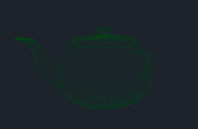

# "One Formula That Demystifies 3D Graphics"... but in GameMaker

After watching tsoding's "One Formula That Demystifies 3D Graphics" video ([which is great, and you should also watch it right here!](https://www.youtube.com/watch?v=qjWkNZ0SXfo)) I thought it would be a fun little project to write the same thing in GameMaker.

You should note at this point that while GameMaker *does* have the ability to interact with new-fangled-3D rendering pipelines via GPU's... this project demonstrates *software rendering* which is noteably slower. As such, you probably shouldn't use it in real games.

## Changes Made

Initially, I wrote this as a direct port of tsoding's JavaScript implementation, but found it to be inefficient given the way GameMaker handles structs & garbage collection... for the simple Penguin object in the video, it rendered around 100fps :(

So! Some changes were in order.

* **Remove reliance on structs:** In the JS implementation, the original code passes objects around containing `{x, y, z}` for every single rotation, translation, and projection. In GameMaker, trying to match this generates thousands of throwaway structs per frame, causing the Garbage Collector to panic and stutter. I replaced this with **pre-allocated arrays** that are reused every frame.
* **Vertex Caching:** In the original implementation, math happened inside the drawing loop. If a single vertex was shared by 4 faces, it was recalculated 4 times. In this version, I separated the pipeline: now we transform all vertices **once** per frame, store the screen coordinates, and the draw loop simply connects the dots using the cached data.
* **Inlining & Micro-optimizations:** I flattened the nested function calls (`line(screen(project(...)))`) directly into the loop to save on function overhead. GameMaker also hits a little speed-bump with the modulo (`%`) operator... I subverted this by restructuring the loop to track the "previous" vertex manually.
* **Depth-Based Line Width:** The original JS used a fixed line width. I added a simple calculation to scale the line thickness based on the Z-depth, making the wireframe feel much more 3D.
* **Safety & Centering:** The GML version includes a divide-by-zero safety check for the camera Z-plane and the OBJ loader automatically centers the model to the world origin, so you don't have to manually adjust your model files.

With these changes, the performance jump was actually pretty noticeable. On my machine, it's up to about 900fps with the same Penguin object.

## The OBJ loader
This implementation also has a simple OBJ loading functionality, demonstrated in the example project here.